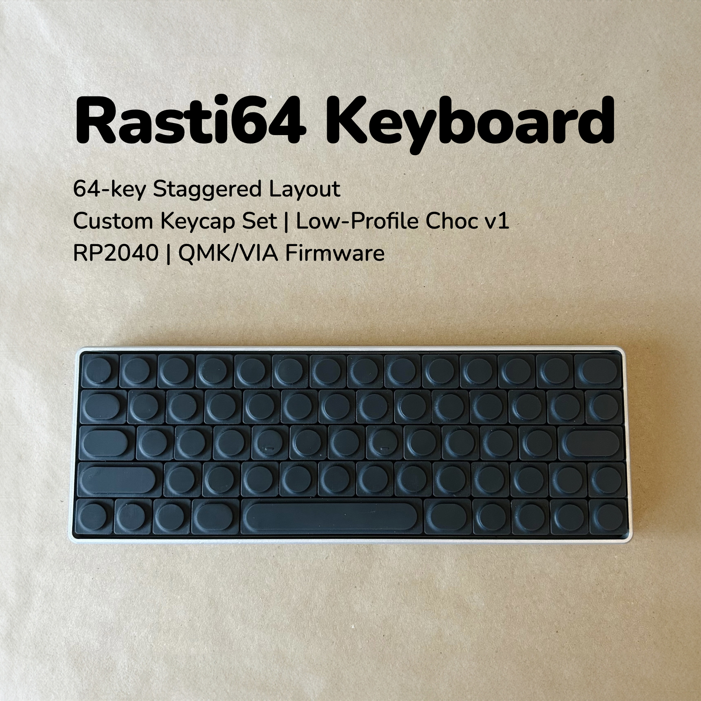

# Rasti64 Keyboard

The Rasti64 keyboard is a simple 64-key wired, low-profile, staggered mechanical keyboard that ticks a few niche boxes of mine:

## Features

- ✅ 65% staggered layout with arrow keys, essentially a MacBook keyboard sans the Function row.
- ✅ Low-profile Choc v1 switches are used; the whole build is under 15mm without the case.
- ✅ A new custom keycap set (ranging from 1U to 2.25U, and a 4.75U spacebar that utilizes the 6.25U stabilizer).
- ✅ Works with standard Choc stabilizers and Choc spacing keycaps.
- ✅ Powered by RP2040-Zero or other compatible boards.
- ✅ QMK/VIA firmware support.

|  |  |
| --- | --- |

The name "Rasti" is derived from the German compound word "Rasterrahmen" (grid + framework).

## Bill of Materials (BOM)

Quantity | Item | Notes
--- | --- | ---
1 | [Rasti64 PCB](gerbers/Gerbers-rasti64-rp2040-zero.zip)
1 | [Rasti64 plate](plate/Gerbers-rasti64-plate.zip) | 1.2mm for PCB thickness
1 | RP2040-Zero MCU 
64 | Kailh choc v1 PG1350 switches 
64 | 1N4148 diodes | Through hole
5 | [Rasti-keycap-set-1U](keycaps/Rasti-keycap-set-1U-v1.3.stl) | Resin print recommended 
2 | [Rasti-keycap-set](keycaps/Rasti-keycap-set-V1.4.stl) | Resin print recommended 
1 | Kailh choc stabilizers | 1 ⨉ 2U and 1 ⨉ 6.25U 
1 | Pin headers or sockets | 23-pin needed 

## Case and Plate

The showcased model features a case CNC machined from Aluminum 6061 with a bead-blasted finish, and SLA-printed black resin keycaps.

- The case can be 3D printed (FDM/SLA) or CNC machined using the provided [STEP file](case/rasti64-case-cnc.step). 
- A [DXF file](plate/rasti64-plate.dxf) and an [STL file](plate/rasti64-plate.stl) are also included, providing options for laser cut or 3D printing alternatives to the standard PCB plate. 

## Firmware 

Precompiled firmware:

- QMK: [penk_rasti64_default.uf2](firmware/penk_rasti64_default.uf2)
- VIA: [penk_rasti64_via.uf2](firmware/penk_rasti64_via.uf2)

A [via.json](QMK/via.json) file is also provided along in the source directory to work with https://usevia.app/. 

## Build Instructions 

1.	Flash firmware to the RP2040 Zero and ensure it’s recognized by host PC.
2.	Solder diodes on the PCB’s underside.
3.	Install stabilizers (2U and 6.25U) to the plate. (Ref: https://docs.keeb.io/choc-stabs)
4.	Place and install switches above the controller area on top of the plate.
5.	Solder header pins on the PCB’s underside.
6.	Attach the plate to the top side of the PCB, ensuring switch feet poke through.
7.	Solder switches above the controller area to the PCB’s underside.
8.	Attach RP2040 Zero to header pins. Consider using kapton tape on the MCU.
9.	Place remaining switches.
10.	Solder all switches from the PCB’s underside.
11. Install keycaps.

## Copyright and License
Copyright (c) 2024 Penk Chen. All rights reserved.

All files are licensed under MIT license, see the [LICENSE](LICENSE) for more information.
